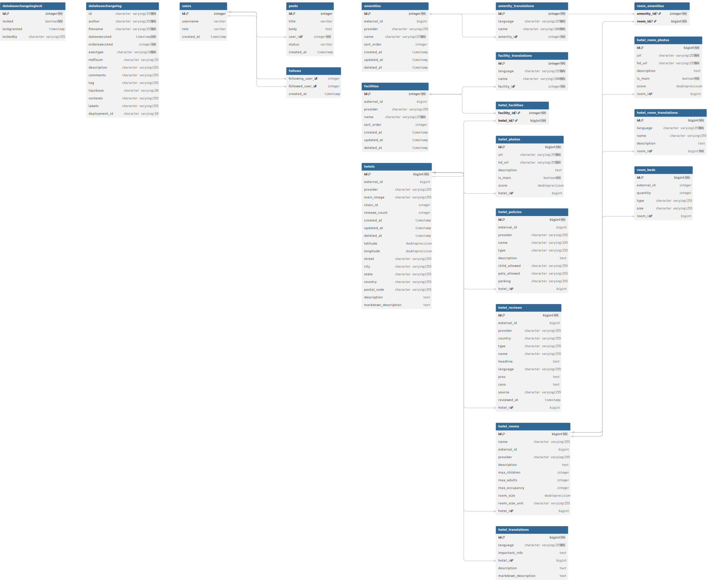

# Cupid Technical Assessment

This is a Spring Boot application for the Cupid technical assessment. It demonstrates a Kotlin backend stack with PostgreSQL, Redis, and Docker Compose integration.

---

## How to Run the App

### Prerequisites

- **Docker**: Required for running PostgreSQL and Redis via Docker Compose.
- **Java 17**: The project uses Java 17 (configured via Gradle toolchain).
- **Gradle**: (Optional) If you want to use the Gradle wrapper, no need to install Gradle globally.

### Steps

1. **Clone the repository**

   ```sh
   git clone <repo-url>
   cd cupid-technical-assessment
   ```

2. **Start the backend and dependencies**

   The project uses [Spring Boot Docker Compose integration](https://docs.spring.io/spring-boot/docs/current/reference/html/docker-compose.html) to automatically start PostgreSQL and Redis containers when you run the app.  
   **You must have Docker running.**

   ```sh
   ./gradlew bootRun
   ```

   - The application will be available at: [http://localhost:8000](http://localhost:8000)
   - PostgreSQL and Redis will be started automatically via Docker Compose.

---

## ️ Technologies Used

- **Kotlin**
- **Spring Boot**
- **Spring Data JPA**
- **Spring Data Redis**
- **Spring Cloud OpenFeign**
- **Liquibase** (database migrations)
- **Testcontainers** (integration testing)
- **PostgreSQL** (database)
- **Redis** (cache)
- **Docker Compose** (service orchestration)
- **Spotless** (code formatting)

---

##  API Documentation

You can test and explore the APIs using **Swagger UI**:

- [http://localhost:8080/swagger-ui/index.html](http://localhost:8080/swagger-ui/index.html)

---

##  Database ER Diagram

Below is the Entity-Relationship (ER) diagram for the database schema:



---

## 🐳 Spring Boot Docker Compose Integration

This project leverages Spring Boot's Docker Compose integration.  
When you run the application, Spring Boot will automatically start the required services (PostgreSQL and Redis) as defined in [`src/main/docker/compose.yml`](src/main/docker/compose.yml).

- **You must have Docker installed and running.**
- No need to manually start the database or cache; they will be orchestrated for you.

---

##  Database Entity Relationships

The database schema models a hotel management system with support for amenities, facilities, rooms, translations, photos, policies, and reviews.

### **Main Entities**

- **hotels**: Represents a hotel.
- **hotel_rooms**: Represents a room in a hotel, linked to `hotels` via `hotel_id`.
- **amenities**: Represents an amenity (e.g., WiFi, pool).
- **facilities**: Represents a facility (e.g., gym, spa).

### **Translations**

- **hotel_translations**: Stores translations for hotel descriptions and info, linked to `hotels`.
- **hotel_room_translations**: Stores translations for room names/descriptions, linked to `hotel_rooms`.
- **amenity_translations**: Stores translations for amenity names, linked to `amenities`.
- **facility_translations**: Stores translations for facility names, linked to `facilities`.

### **Photos**

- **hotel_photos**: Photos for hotels, linked to `hotels`.
- **hotel_room_photos**: Photos for hotel rooms, linked to `hotel_rooms`.

### **Policies & Reviews**

- **hotel_policies**: Policies for a hotel, linked to `hotels`.
- **hotel_reviews**: Reviews for a hotel, linked to `hotels`.

### **Room Details**

- **room_beds**: Beds in a room, linked to `hotel_rooms`.

### **Many-to-Many Relationships**

- **hotel_facilities**: Links hotels and facilities (many-to-many).
- **room_amenities**: Links rooms and amenities (many-to-many).

---

**Summary of Relationships:**

- **Hotel** has many **Rooms**, **Photos**, **Policies**, **Reviews**, **Translations**, and **Facilities** (via `hotel_facilities`).
- **Room** has many **Photos**, **Beds**, **Translations**, and **Amenities** (via `room_amenities`).
- **Amenity** and **Facility** have many **Translations**.
- **Many-to-many**: Hotels ↔ Facilities, Rooms ↔ Amenities.

---

## Redis Caching Strategy

The application uses Redis to cache frequently accessed data and reduce database and third-party API load. The cache keys are structured to optimize retrieval for different data types and languages:

```
Cache Keys Structure:
├── hotel:{hotel_id}:{language}                    
├── hotel:details:{hotel_id}:fr                    
├── hotel-reviews:{hotel_id}:{page}:{size}         
├── facilities:all                                 
├── amenities:all                                              
```

- `hotel:{hotel_id}:{language}`: Caches hotel details per hotel and language.
- `hotel:details:{hotel_id}:fr`: Example for French hotel details.
- `hotel-reviews:{hotel_id}:{page}:{size}`: Caches paginated hotel reviews.
- `facilities:all` and `amenities:all`: Caches all facilities and amenities for quick reference.

---

## Data Flow & Storage Strategy

### 1. Hotel Details Request Flow

When a user requests hotel details (e.g., `GET /api/v1/hotels/123?lang=fr`), the system follows this flow:

```
User Request (GET /api/v1/hotels/123?lang=fr)
        │
        ▼
┌─────────────────┐    Cache Hit?    ┌──────────────────┐
│  Check Redis    │ ──────Yes──────► │  Return Cached   │
│  Cache          │                  │  Response        │
└─────────────────┘                  └──────────────────┘
        │ No
        ▼
┌─────────────────┐
│  Check DB for   │    Exists?    ┌──────────────────┐
│  Hotel + Trans  │ ────Yes──────► │  Build Response  │
└─────────────────┘                │  Cache & Return  │
        │ No                       └──────────────────┘
        ▼
┌─────────────────┐
│  Fetch from     │                ┌──────────────────┐
│  Third Party    │ ──────────────► │  Store in DB     │
│  APIs           │                │  Cache & Return  │
└─────────────────┘                └──────────────────┘
```

- First, the cache is checked for the requested hotel and language.
- If not found, the database is queried for the hotel and its translations.
- If still not found, data is fetched from third-party APIs, stored in the database, and cached for future requests.

---

### 2. Translation Storage Strategy

**Approach: English as Primary, Translations as Extensions**

- The main hotel table stores core data in English (the primary language).
- Translation tables store only the translated fields for other languages.
- Facilities and amenities have their own translation tables.
- If a translation is missing, the system falls back to the English version.

---

### 3. Review Data Management

**Strategy: Batch Sync + Pagination**

- **Initial Sync**: Large batches of reviews (e.g., 100–500) are fetched and stored in the database.
- **Incremental Updates**: Additional reviews are synced in the background.
- **Pagination**: Database-level pagination is used for retrieval.
- **Caching**: Paginated review results are cached in Redis for frequently accessed pages.

---

### 4. Reference Data Management (Facilities & Amenities)

**One-time Sync Strategy:**

- Facilities and amenities are synced from third-party APIs on the first request that needs them.
- Data is stored in dedicated tables with translations.
- Reference data is cached in Redis with a long time-to-live (TTL) for fast access.

---

## System Behavior Examples

### Scenario 1: French Hotel Details Request

```
1. User requests hotel details in French
2. Check Redis cache for hotel:123:fr
3. If cache miss:
   a. Query DB for hotel + French translations
   b. If French translations exist: merge and return
   c. If no French translations: fetch from third-party API
   d. Store translations in DB and cache result
4. Return response with French translations + English fallbacks
```

### Scenario 2: Review Pagination

```
1. User requests page 1 of reviews (limit 10)
2. Check Redis cache for hotel-reviews:123:1:10
3. If cache miss:
   a. Query DB with OFFSET, and LIMIT 10
   b. Trigger background sync
   c. Cache paginated result
4. Return paginated reviews
```

---

## Running Tests

To run all tests:

```sh
./gradlew test
```

Integration tests use Testcontainers to spin up isolated PostgreSQL and Redis containers.

---

## Code Formatting

This project uses [Spotless](https://github.com/diffplug/spotless) for code formatting.

To format the codebase:

```sh
./gradlew spotlessApply
```

---

##  Configuration

Application configuration is in [`src/main/resources/application.yml`](src/main/resources/application.yml).

- **PostgreSQL**: Runs on port 5432 (default), credentials can be set via environment variables.
- **Redis**: Runs on port 6379 (default).
- **App Port**: The backend runs on port **8000**.

---

## Useful Commands

| Task              | Command                   |
|-------------------|---------------------------|
| Run the app       | `./gradlew bootRun`       |
| Run tests         | `./gradlew test`          |
| Format code       | `./gradlew spotlessApply` |
| Build the project | `./gradlew build`         |

---

## Notes

- Ensure Docker is running before starting the application.
- The Gradle wrapper (`./gradlew`) is included; no need to install Gradle globally.
- Swagger UI is available for API exploration and testing.
- There is a `.env` file at `src/main/docker/.env` used **solely for the development environment**.  
  You can set your PostgreSQL username, password, and database name here.  
  This file is only used in development and can be safely altered as needed.


- **Note:** There is currently **no data invalidation strategy** implemented for cached data in this project. Cached entries remain until they expire based on their TTL or are manually cleared.

